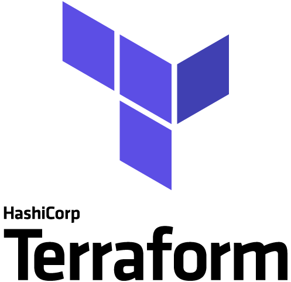

# environment #

## Quick summary  

 Terraform infrastructure containing: 

### network

- 1 network called `airflow-celery-net`

### containers 

- 1  [PostgreSQL](#postgresql)
- 1  [airflow](#airflow)


# container descriptions #

## PostgreSQL


### software

- PostgreSQL 13.5
- debian 11 (bullseye)

### exposed ports (host:container)

- 5432:5432

### container specific info

#### database
| database name | user    | password |
|---------------|---------|----------|
| airflow_db    | airflow | airflow  |

## airflow


### software

- airflow 2.2.2
  - extras
    - celery
    - postgres
    - apache.hive
    - jdbc
    - mysql
    - ssh
    - redis
- python 3.7
- pip 21.2.4
- git 2.20.1
- netcat
- debian 10 (buster)

### exposed ports (host:container)

- 8080:8080

### container specific info

#### URL

http://localhost:8080/

|              |         |
|--------------|---------|
| **Username** | airflow |
| **Password** | airflow |

#### Local dags directory

The `DAG`s directory is mounted outside the container.  

`DAG` directory mount location:

```bash
[git repo root]/mnt/airflow/dags
```

Any `DAG` placed at this directory will be visible at visible inside the container.  


